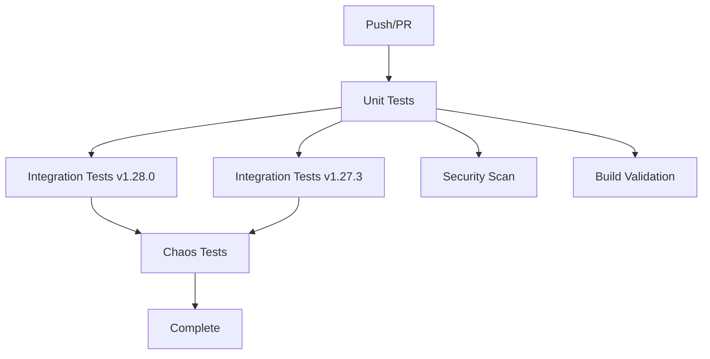

# CI/CD Workflows for System Design Repository

This directory contains GitHub Actions workflows for automated testing and validation of various system design projects.

## 🚀 Available Workflows

### `consistent-hashing-test.yml` - Consistent Hashing System Tests

Comprehensive testing pipeline for the consistent hashing distributed system located in the `consistent_hashing/` directory.

#### **Pipeline Overview:**
- **Unit Tests**: Fast feedback with coverage reporting
- **Integration Tests**: Full Kind cluster deployment and testing
- **Chaos Engineering**: Resilience testing (main branch only)
- **Security Scanning**: Vulnerability detection with Trivy
- **Build Validation**: Docker image build verification

#### **Trigger Conditions:**
```yaml
# Automatic triggers
- Push to main/develop branches (when consistent_hashing/ files change)
- Pull requests to main (when consistent_hashing/ files change)

# Manual trigger
- workflow_dispatch (manual execution)
```

#### **Test Matrix:**
- **Kubernetes Versions**: v1.28.0, v1.27.3
- **Python Version**: 3.11
- **Test Types**: Unit, Integration, E2E, Chaos, Security

#### **Expected Results:**
- **Unit Tests**: ~2 minutes, >90% pass rate
- **Integration Tests**: ~15 minutes per K8s version
- **Load Tests**: >80% success rate for 50 concurrent operations
- **Security**: No high-severity vulnerabilities
- **Build**: All Docker images build successfully

## 📊 Pipeline Architecture



## 🔧 Infrastructure Details

### Kind Cluster Configuration
- **Control Plane**: 1 node with port mappings
- **Workers**: 2 nodes for multi-node testing
- **Registry**: Local container registry on NodePort 32000
- **Networking**: Full pod-to-pod communication

### Test Environment
- **Platform**: Ubuntu 22.04 (GitHub hosted runners)
- **Container Runtime**: Docker with BuildKit
- **Orchestration**: Kind (Kubernetes in Docker)
- **Monitoring**: kubectl logs and cluster state collection

## 📈 Quality Gates

### Pull Request Requirements
- ✅ All unit tests pass
- ✅ Integration tests pass on at least one Kubernetes version
- ✅ No high-severity security vulnerabilities
- ✅ Docker images build successfully
- ✅ Code coverage >85%

### Main Branch Additional Requirements
- ✅ Chaos engineering tests pass
- ✅ Load tests achieve >90% success rate
- ✅ Full security scan clean

## 🚀 Usage

### Automatic Execution
The workflows automatically trigger on relevant code changes. No manual intervention required for most scenarios.

### Manual Execution
1. Go to the **Actions** tab in GitHub
2. Select "Consistent Hashing System Tests"
3. Click "Run workflow"
4. Choose the branch and click "Run workflow"

### Local Development
To simulate the CI environment locally:

```bash
# Set up environment
export PYTHONPATH="./consistent_hashing"
cd consistent_hashing

# Run unit tests
python -m pytest tests/unit/ -v --cov=gateway --cov=storage

# Build Docker images
docker build -f gateway/Dockerfile -t consistent-hashing/gateway:test .
docker build -f storage/kvstore/Dockerfile -t consistent-hashing/kvstore:test .

# Test images
docker run --rm consistent-hashing/gateway:test python -c "from simple_hash_ring import SimpleHashRing; print('OK')"
```

## 📊 Artifacts and Reports

### Collected Artifacts
- **Test Results**: JUnit XML files for all test suites
- **Coverage Reports**: HTML reports with detailed coverage analysis
- **Security Scans**: SARIF files uploaded to GitHub Security tab
- **System Logs**: Kubernetes cluster logs and pod information

### Artifact Retention
- **Test artifacts**: 30 days
- **Security results**: Permanent (GitHub Security tab)
- **Logs**: Available in workflow run details

## 🔍 Monitoring and Debugging

### Success Monitoring
- **Dashboard**: GitHub Actions tab shows workflow status
- **Notifications**: GitHub notifications for failures
- **Trends**: Track success rates and execution times

### Debugging Failed Runs
1. **Check workflow logs**: Detailed step-by-step execution logs
2. **Download artifacts**: Test results and coverage reports
3. **Review system info**: Cluster state and pod logs collected automatically
4. **Security results**: Check GitHub Security tab for vulnerability details

### Common Issues and Solutions
| Issue | Solution |
|-------|----------|
| Kind cluster creation fails | Check Docker daemon status, retry workflow |
| Image build failures | Verify Dockerfile syntax, check base image availability |
| Test timeouts | Review resource limits, increase timeout values |
| Port forwarding issues | Check service status, verify pod readiness |

## 🔄 Maintenance

### Regular Updates
- **GitHub Actions**: Update action versions quarterly
- **Tools**: Keep Kind, kubectl, Python versions current
- **Dependencies**: Update base images and Python packages
- **Security**: Review and update Trivy scanner configuration

### Performance Optimization
- **Caching**: Python dependencies cached between runs
- **Parallelization**: Jobs run concurrently where possible
- **Resource Management**: Cleanup ensures no resource leaks
- **Matrix Strategy**: Test multiple Kubernetes versions efficiently

## 🎯 Future Enhancements

### Planned Improvements
- **Multi-arch builds**: ARM64 support for Apple Silicon
- **Performance benchmarks**: Automated performance regression detection
- **Integration tests**: Additional cloud provider testing
- **Deployment automation**: Auto-deploy to staging environments

### Contributing
When adding new workflows:
1. Follow the existing naming convention
2. Include comprehensive documentation
3. Add appropriate quality gates
4. Ensure proper cleanup and resource management
5. Test thoroughly before merging

---

This CI/CD setup ensures the consistent hashing system maintains enterprise-grade quality, reliability, and security standards across all development phases. 